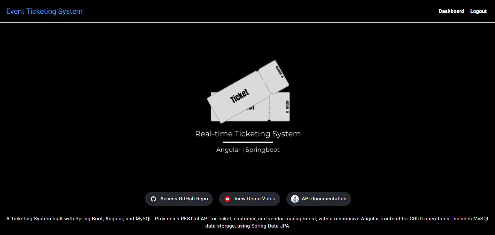

# Ticketing System


A Ticketing System designed to simulate a real-time ticket booking process. The system includes:

- **Vendor Threads**: Add tickets to the pool.
- **Customer Threads**: Book tickets from the pool.
- **WebSocket Integration**: Real-time updates on ticket status.
- **User Authentication**: Admins can register and log in.

## Technologies Used

### Backend
- Java 17
- Spring Boot
- Spring Security (for authentication)
- WebSockets

### Frontend
- Angular
- WebSocket

### Database
- MySQL

### Build Tools
- Maven
- Node.js
- npm

## Prerequisites
Before running the application, ensure you have the following installed:
- Java 17 or higher (for the backend ticketing logic)
- Node.js 14.x or higher (for the Angular frontend)
- Maven (for building and managing Java project dependencies)
- Visual Studio Code (for frontend development)
- IntelliJ IDEA (for backend development)

## Setup Instructions

### 1. Clone the Repository
Clone the repository and navigate to the project folder:

```bash
git clone https://github.com/omeshapasan2/Ticketing-System-Springboot-Angular-MySQL.git
cd Ticketing-System-Springboot-Angular-MySQL
```

### 2. Build the Backend (Spring Boot Application)
Navigate to the root directory of your Spring Boot application and use Maven to build it:

```bash
cd Springboot
mvn clean install
```

### 3. Run the Backend Application
After building the application, you can start the Spring Boot backend:

```bash
mvn spring-boot:run
```
This will start the backend on [http://localhost:8080](http://localhost:8080).

### 4. Frontend (Angular Application)
Navigate to the frontend directory and set up the Angular application:

```bash
cd Angular
npm install
```

Start the Angular development server:

```bash
ng serve
```
OR

```bash
npm start
```
This will start the frontend on [http://localhost:4200](http://localhost:4200).

## Authentication Features

### Register
Users can register by creating an account. The Register form collects the following information:
- Username
- Email
- Password

After successful registration, users are redirected to the Login page.

### Login
After registering, users can log in using their Username and Password. Upon successful login, they are directed to the Admin Dashboard.

### JWT Token Generation
The `JwtTokenProvider` class handles the generation and validation of JWT tokens for user authentication. Tokens are generated upon successful login.

## Routes and Endpoints

### Frontend Routes:
- `/home`: Displays information about the system with links.
- `/register`: Displays the registration form for creating an account.
- `/login`: Displays the login form to authenticate users.
- `/admin-dashboard`: The Admin Dashboard (accessible only after successful login).
- `/logout`: Redirects users back to the login screen.

### Backend Routes (Spring Boot):
- `POST /auth/register`: Endpoint to register a new user.
- `POST /auth/login`: Endpoint to authenticate the user and generate a JWT token.
- `GET /api/ticketing/logs`: Endpoint to retrieve logs for ticket addition/removal from the backend.

## Admin Dashboard Features
Once logged in, admins can:

- Configure the ticket pool:
  - Total Tickets
  - Ticket Release Rate
  - Customer Retrieval Rate
  - Maximum Ticket Capacity
- Start and stop the ticketing process.
- Monitor real-time logs of how vendors release tickets and how customers purchase them.

## Usage Instructions

### Register a New User
1. Go to `/register` (Frontend page).
2. Fill in the Username, Email, and Password fields.
3. Click **Register** to create a new account.
4. After a successful registration, you will be redirected to the Login page.

### Login
1. Go to `/login` (Frontend page).
2. Enter your Username and Password.
3. After successful login, you will be redirected to the Admin Dashboard.

## Screenshots

### Home Page


### Register Page


### Login Page


### Admin Dashboard


---